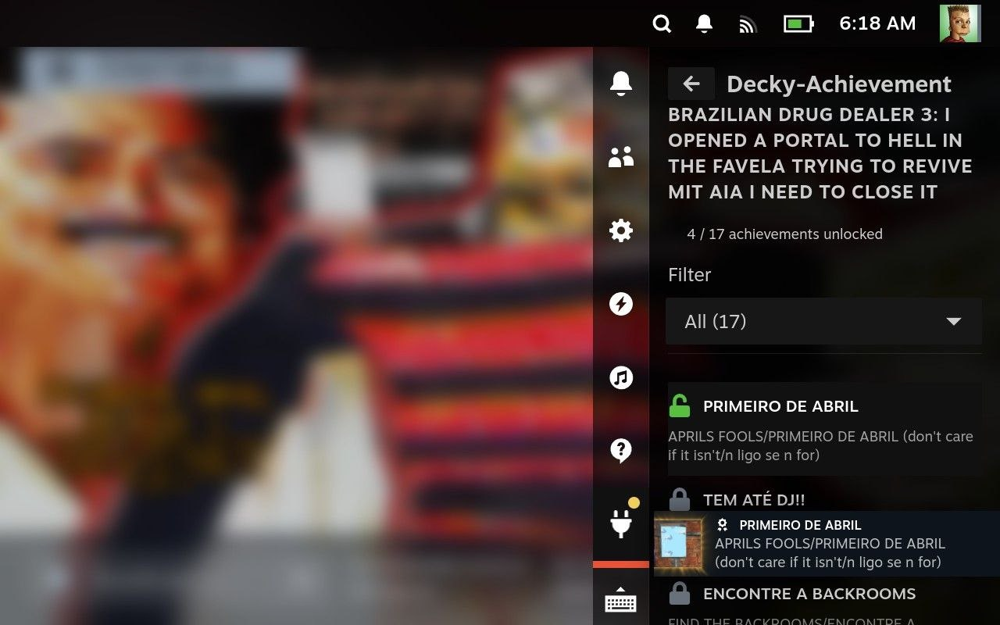

# Decky-Achievement

**Check out our Telegram group if you seek help with the plugin! @steamdeckoverclock**



Decky-Achievement is a Decky Loader plugin that allows you to unlock/lock achievements for the currently running game.

Thanks to [Samira](https://github.com/jsnli/Samira) and [Steam Achievement Manager (SAM)](https://github.com/Gibbed/SteamAchievementManager) for inspiring this project.

## Future Plans

- [x] Achievement management for the currently running game
- [ ] Allow to unlock/lock achievements for specific, non-running game.

## Usage

#### Using the Plugin

1. Launch a game you want to manipulate achievements for.
2. Open the Decky Loader plugin menu and select Decky-Achievement.
3. The plugin shows the currently running game's name and how many achievements are unlocked (e.g. "X / Y achievements unlocked").
4. Use the **Filter** dropdown to view **All**, **Unlocked**, or **Locked** achievements.
5. Tap an achievement to toggle it: unlock a locked one or lock an unlocked one. Changes are saved to Steam.

## Compatibility

Tested on SteamOS. Expected to work on Steam Deck with Decky Loader. Not supported on Windows.

Issues related to the plugin should be reported on the [issues page](https://github.com/totallynotbakadestroyer/decky-achievement/issues).

### Prerequisites

Decky Loader is required. You can download it from the [Decky Loader Website](https://decky.xyz/).

### Quick Install / Update

#### 1st Method

Run the following in terminal:

```
curl -L https://github.com/totallynotbakadestroyer/decky-achievement/raw/master/install.sh | sh
```

After running the script, the plugin will appear in the Decky Loader plugin list.

#### 2nd Method

1. Download the latest release from the [releases page](https://github.com/totallynotbakadestroyer/decky-achievement/releases).
2. Move the downloaded archive to your Steam Deck.
3. In Decky Loader settings, enable developer mode and install the plugin from the archive.

